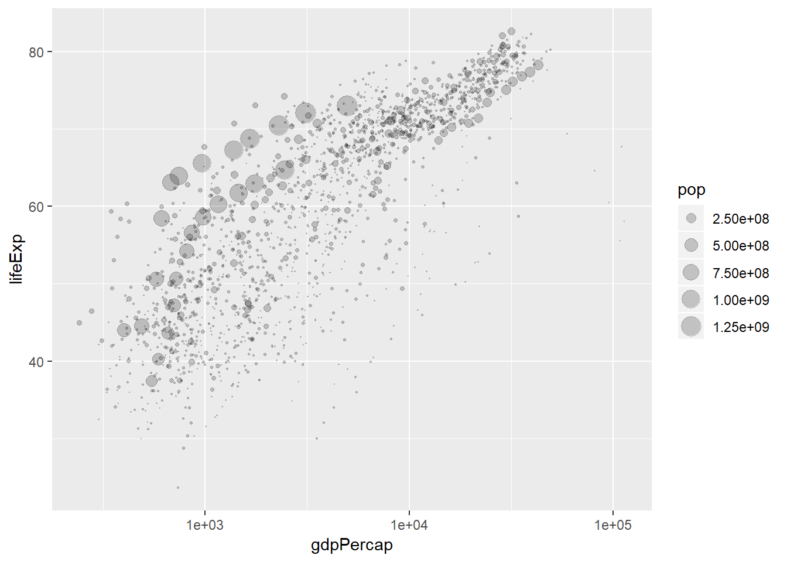

---
title: "cm007 Exercises: Exploring Aesthetic Mappings"
output: html_notebook
editor_options: 
  chunk_output_type: inline
---


```r
library(gapminder)
library(tidyverse)
```

```
## -- Attaching packages ------------------------------------------------------------------------- tidyverse 1.2.1 --
```

```
## v ggplot2 3.0.0     v purrr   0.2.5
## v tibble  1.4.2     v dplyr   0.7.6
## v tidyr   0.8.1     v stringr 1.3.1
## v readr   1.1.1     v forcats 0.3.0
```

```
## -- Conflicts ---------------------------------------------------------------------------- tidyverse_conflicts() --
## x dplyr::filter() masks stats::filter()
## x dplyr::lag()    masks stats::lag()
```


# Beyond the x and y aesthetics

Switch focus to exploring aesthetic mappings, instead of geoms. 

## Shapes


```r
gvsl <- ggplot(gapminder, aes(gdpPercap, lifeExp)) +
  scale_x_log10()
gvsl + geom_point(aes(shape=continent))
```

<!-- -->

- Try a scatterplot of `gdpPercap` vs `pop` with a categorical variable (continent) as `shape`.
- As with all (?) aesthetics, we can also have them _not_ as aesthetics!
    - Try some shapes: first as integer from 0-24, then as keyboard characters.
    - What's up with `pch`?


```r
gvsl + geom_point(shape=7)
```

<!-- -->

```r
gvsl + geom_point(pch=7)
```

<!-- -->

```r
gvsl + geom_point(shape = '$')
```

<!-- -->

List of shapes can be found [at the bottom of the `scale_shape` documentation](https://ggplot2.tidyverse.org/reference/scale_shape.html).

## Colour

Make a scatterplot. Then:

- Try colour as categorical variable.


```r
gvsl + geom_point(aes(color = continent))
```

<!-- -->

- Try `colour` and `color`. 
- Try colour as numeric variable.
*the darker the shade, the larger the population

```r
gvsl + geom_point(aes(color = pop))
```

<!-- -->

    - Try `trans="log10"` for log scale.
*the more blue the larger the population

```r
gvsl + geom_point(aes(color = pop)) + scale_color_continuous(trans="log10")
```

<!-- -->

```r
#now let's color by life exp. gretaer than 60
#ggplot under hood makes new column with Trues and Falses
#and then it takes new variable and maps it onto color
#so it creates a dichotomous variable
gvsl + geom_point(aes(color = lifeExp>60))
```

<!-- -->

Make a line plot of `gdpPercap` over time for all countries. Colour by `lifeExp > 60` (remember that `lifeExp` looks bimodal?)


Try adding colour to a histogram. How is this different?

```r
ggplot(gapminder, aes(lifeExp)) + 
  geom_histogram(aes(fill=continent))
```

```
## `stat_bin()` using `bins = 30`. Pick better value with `binwidth`.
```

<!-- -->

```r
#example of overplotting (too much information on one plot)
#e.g., does red color go all the way to bottom? can't tell from plot
```

## Facetting

Make histograms of `gdpPercap` for each continent. Try the `scales` and `ncol` arguments. 

```r
#make a plot for every category (here: 5 continents)
ggplot(gapminder, aes(lifeExp)) +
  facet_wrap(~ continent) +
  geom_histogram()
```

```
## `stat_bin()` using `bins = 30`. Pick better value with `binwidth`.
```

<!-- -->

```r
#here: X axis all the same

#I can free this up:
ggplot(gapminder, aes(lifeExp)) +
  facet_wrap(~ continent, scales = 'free_x') +
  geom_histogram()
```

```
## `stat_bin()` using `bins = 30`. Pick better value with `binwidth`.
```

<!-- -->

```r
#in this case this makes it harder to compare the graphs but may be useful in other situations
```


Remove Oceania. Add another variable: `lifeExp > 60`. 


```r
ggplot(gapminder, aes(gdpPercap)) +
  facet_grid(continent ~ lifeExp > 60) +
  geom_histogram()
```

```
## `stat_bin()` using `bins = 30`. Pick better value with `binwidth`.
```

<!-- -->

```r
#here we have the 5 continents and then show gdp depending on life exp.

#we can change x axis so t is on a log scale
```


## Bubble Plots

- Add a `size` aesthetic to a scatterplot. What about `cex`?


```r
gvsl + geom_point(aes(size = pop), alpha=0.2)
```

<!-- -->

```r
#the size it is mapped to is not really meaningful
#make proportional to pouplation
gvsl + geom_point(aes(size = pop), alpha=0.2) +
  scale_size_area()
```

<!-- -->

```r
#now the size of the bubbles are proportional to the size of the population
```


- Try adding `scale_radius()` and `scale_size_area()`. What's better?
- Use `shape=21` to distinguish between `fill` (interior) and `colour` (exterior).


```r
#shape NOT in aes, fill = continent
gvsl + geom_point(aes(size = pop, fill=continent), shape = 21, color = 'black', alpha=0.2)
```

<!-- -->


## "Complete" plot

Let's try plotting much of the data.

- gdpPercap vs lifeExp with pop bubbles
- facet by year
- colour by continent


```r
gvsl + geom_point(aes(size=pop, color=continent)) + 
  scale_size_area() + 
  facet_wrap(~year)
```

<!-- -->


# Continue from last time (geom exploration with `x` and `y` aesthetics)

## Path plots

Let's see how Rwanda's life expectancy and GDP per capita have evolved over time, using a path plot.

- Try `geom_line()`. Try `geom_point()`.
- Add `arrow=arrow()` option.
- Add `geom_text`, with year label. 


```r
gapminder %>%
  filter(country == "Rwanda") %>%
  arrange(year)%>% #to make sure that ordered by year
  ggplot(aes(gdpPercap, lifeExp)) +
  #scale_x_log10() +
  geom_point() +
  geom_line() +
  geom_path(arrow=arrow())
```

<!-- -->


## Two categorical variables

Try `cyl` (number of cylinders) ~ `am` (transmission) in the `mtcars` data frame.

- Scatterplot? Jitterplot? No.
- `geom_count()`.
- `geom_bin2d()`. Compare with `geom_tile()` with `fill` aes.


```r
ggplot(mtcars, aes(factor(cyl), factor(am))) + #need to tell gglot that cyl and am are factors
  #geom_count()
  geom_bin2d()
```

<!-- -->

```r
ggplot(mtcars, aes(factor(cyl), factor(am))) + #need to tell gglot that cyl and am are factors
  geom_bin2d()
```

<!-- -->


## Overplotting

Try a scatterplot with:

- Alpha transparency.
- `geom_hex()`
- `geom_density2d()`
- `geom_smooth()`


```r
library(hexbin)
gvsl + geom_hex()
```

<!-- -->

```r
gvsl + geom_density2d()
```

<!-- -->

```r
gvsl + geom_point(alpha = 0.2) + geom_smooth()
```

```
## `geom_smooth()` using method = 'gam' and formula 'y ~ s(x, bs = "cs")'
```

<!-- -->

```r
gvsl + geom_point(alpha = 0.2) + geom_smooth(method="lm")
```

<!-- -->


## Bar plots

How many countries are in each continent? Use the year 2007.

1. After filtering the gapminder data to 2007, make a bar chart of the number of countries in each continent. Store everything except the geom in the variable `d`.


```r
gapminder %>%
  filter(year==2007) %>%
  ggplot(aes(x=continent)) + #y axis is ount, but ggplot does that under the hood
  geom_bar()
```

<!-- -->


2. Notice the y-axis. Oddly, `ggplot2` doesn't make it obvious how to change to proportion. Try adding a `y` aesthetic: `y=..count../sum(..count..)`.


__Uses of bar plots__: Get a sense of relative quantities of categories, or see the probability mass function of a categorical random variable.


## Polar coordinates

- Add `coord_polar()` to a scatterplot.

```r
gvsl + geom_point() + coord_polar()
```

<!-- -->


# Want more practice?

If you'd like some practice, give these exercises a try

__Exercise 1__: Make a plot of `year` (x) vs `lifeExp` (y), with points coloured by continent. Then, to that same plot, fit a straight regression line to each continent, without the error bars. If you can, try piping the data frame into the `ggplot` function.

__Exercise 2__: Repeat Exercise 1, but switch the _regression line_ and _geom\_point_ layers. How is this plot different from that of Exercise 1?

__Exercise 3__: Omit the `geom_point` layer from either of the above two plots (it doesn't matter which). Does the line still show up, even though the data aren't shown? Why or why not?

__Exercise 4__: Make a plot of `year` (x) vs `lifeExp` (y), facetted by continent. Then, fit a smoother through the data for each continent, without the error bars. Choose a span that you feel is appropriate.

__Exercise 5__: Plot the population over time (year) using lines, so that each country has its own line. Colour by `gdpPercap`. Add alpha transparency to your liking. 

__Exercise 6__: Add points to the plot in Exercise 5.
